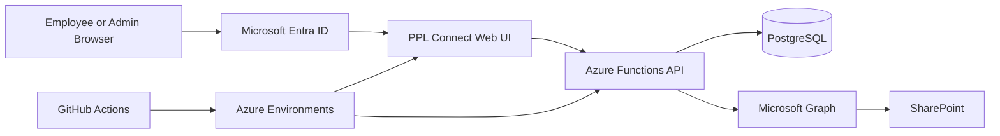

# PPL Connect

**An internal employee and operations platform I designed and developed for Paul Padda Law.**

`TypeScript` · `Node.js` · `Azure Functions` · `PostgreSQL` · `Microsoft Entra ID` · `Microsoft Graph` · `SharePoint` · `GitHub Actions` · `Vitest`

PPL Connect started as a browser-based internal tool and grew into an authenticated, API-backed platform with persistent workflows, role-based access, document management, testing, and controlled deployment.

This repository is a **sanitized technical case study**. The production source remains private because it contains internal operational data and configuration. No employee data, client data, credentials, production identifiers, or proprietary documents are included here.

## Why I built it

I was already working across analytics, reporting, data quality, automation, and operational problem solving. As more internal processes surfaced, it became clear that some problems needed more than a dashboard or a spreadsheet.

The challenge was to bring employee workflows, documents, internal communication, access control, and administrative processes into one system while keeping identity, permissions, data persistence, and production risk under control.

That became PPL Connect.

## What I built

I worked across the platform end to end, including:

- application and workflow design
- TypeScript backend development with Azure Functions
- PostgreSQL data modeling and versioned migrations
- Microsoft Entra authentication
- server-side role and authorization rules
- employee onboarding, Day-30, and offboarding workflows
- staff directory and employee lifecycle management
- internal announcements, inbox, requests, recognition, and employee journey features
- Microsoft Graph and SharePoint document workflows
- restricted employee document handling
- audit-oriented application behavior
- automated testing and PostgreSQL-backed integration testing
- GitHub Actions deployment workflows
- separate Development and Production controls
- production troubleshooting and release hardening

The part I value most is not any single feature. It is that I had to understand the business process, model the data and states behind it, define security boundaries, build the system, test it, and make it usable for real internal workflows.

## Architecture

The browser handles the user experience, but privileged decisions do not rely on the browser. Authentication is established through Microsoft identity, application authorization is enforced server-side, PostgreSQL stores workflow and application state, and document operations are mediated through backend-controlled Microsoft Graph and SharePoint integrations.

[Read the architecture deep dive](docs/architecture.md)

## Platform capabilities

### Employee lifecycle

PPL Connect supports workflows around new hires, onboarding, Day-30 follow-up, offboarding, employee provisioning, and lifecycle state. I moved these workflows away from browser-only state so that progress, ownership, and status could persist reliably.

### People and organization

The platform includes staff directory and employee-profile capabilities, role mapping, access relationships, and administrative updates. Employee-facing data and more restricted information are treated as different security concerns.

### Documents

I built SharePoint-backed document workflows through Microsoft Graph, including browsing, upload and download operations, document requests, restricted employee documents, and later document-completion and review flows.

A key design decision was to keep privileged storage destinations under server control rather than allowing the browser to choose arbitrary internal locations.

[Read the document-management deep dive](docs/document-management.md)

### Employee experience

The platform also grew to support announcements, an internal inbox, requests, recognition, learning and employee-journey workflows, and other shared internal resources.

### Administration

Business administration and technical maintenance are intentionally not treated as the same thing. The authorization model separates normal employee access, elevated business functions, and restricted technical administration.

## Technical decisions that mattered

### 1. Authorization belongs on the server

Hiding a button is not security. I designed the API as the enforcement boundary so that privileged actions are validated on the server even if a browser request is modified or sent directly.

### 2. Authentication and application identity are different concerns

Microsoft sign-in proves who a person is. The application still needs to decide whether that identity is provisioned, which employee record it belongs to, and what the person is allowed to do inside PPL Connect.

### 3. Important workflows need persistent state

Early browser-local patterns were useful for prototyping, but onboarding, offboarding, messages, requests, document state, and administrative workflows needed database-backed persistence and server-side rules.

### 4. Document access needs its own boundary

Microsoft Graph is powerful. I put document operations behind a backend gateway so the UI does not receive unrestricted storage authority. The server determines where protected documents belong and which operations are permitted.

### 5. Database changes should be explicit

The platform uses ordered PostgreSQL migrations. Production database changes are controlled separately from normal application deployment so schema changes do not happen silently just because a new frontend or API build is released.

### 6. Development and Production should be separate

I maintained distinct environment concerns for configuration, resources, authentication, database behavior, and deployment. Production release paths include additional controls rather than treating production as another development target.

## Database and workflow engineering

PostgreSQL became the source of truth for application state as the platform matured. The schema evolved through versioned migrations to support employee lifecycle, onboarding, offboarding, document metadata, messaging, workflow status, audit events, and administrative features.

I used transactional updates where workflows required several related changes to succeed or fail together, and I treated migrations as part of the application rather than one-off manual SQL.

[Read the database and migrations deep dive](docs/database-and-migrations.md)

## Authentication and security

The security model combines Microsoft Entra authentication with application-level identity and role checks. The system does not assume that a signed-in Microsoft user automatically has access to every PPL Connect function.

The design includes server-side authorization, explicit privileged-role boundaries, restricted-data separation, environment-based secrets, controlled Graph access, and separation between business administration and technical maintenance.

[Read the security-model deep dive](docs/security-model.md)

## Testing and deployment

The backend uses TypeScript and Vitest, with regression coverage across application services, authorization, workflows, document behavior, and database-backed paths. PostgreSQL integration testing is used where persistence behavior matters.

GitHub Actions supports repeatable build and deployment workflows, while production release and database-maintenance paths include additional controls.

[Read the testing and deployment deep dive](docs/testing-and-deployment.md)

## Sanitized technical examples

The [`examples`](examples/) directory contains small, self-contained adaptations of patterns I used while building PPL Connect. They are intentionally generic and do not contain production identifiers or internal data.

- [Authenticated principal parsing](examples/authentication-principal.ts)
- [Server-side role authorization](examples/role-authorization.ts)
- [SharePoint gateway boundary](examples/sharepoint-gateway.ts)
- [Versioned PostgreSQL migration](examples/migration-example.sql)
- [Authorization test pattern](examples/integration-test-example.ts)

These are examples of the engineering patterns, not copies of production files.

## What this project changed for me

PPL Connect changed how I think about analytics work.

Sometimes the right answer is a SQL query, a dashboard, or a forecast. Other times the real problem is underneath the reporting layer and needs a database, an API, authentication, workflows, automation, and a product people can actually use.

Building this platform gave me experience moving across those layers while staying close to the business problem that started the work in the first place.

## Repository note

This public repository documents the architecture and engineering approach without publishing the production application. The private production repository contains internal operational data and configuration, so it is intentionally not mirrored here.