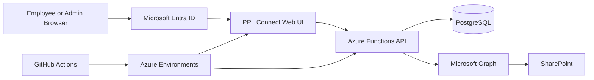

# PPL Connect

**An internal employee and operations platform I took from an early browser prototype to an authenticated, database-backed application used for real internal workflows.**

`TypeScript` · `Node.js` · `Azure Functions` · `PostgreSQL` · `Microsoft Entra ID` · `Microsoft Graph` · `SharePoint` · `GitHub Actions` · `Vitest`

PPL Connect grew from a practical internal need into a multi-layer application spanning employee lifecycle workflows, documents, requests, internal communication, training, administration, identity, security, testing, and production deployment.

I worked across the product end to end: understanding the business problem, deciding how the workflow should behave, modeling the data, building the application, integrating Microsoft services, testing the system, deploying it, and fixing the problems that appear when an application is used in practice.

This repository is a **sanitized technical case study**. The production source remains private because it contains internal operational data and configuration. No employee data, client data, credentials, production identifiers, or proprietary documents are included here.

## Project at a glance

| | |
| --- | --- |
| **Problem** | Internal employee and operational workflows were spread across separate processes, tools, documents, and manual handoffs. |
| **What I built** | A secure internal platform that brings employee lifecycle, document, request, communication, learning, and administrative workflows into one application. |
| **My role** | I drove the work from problem definition through architecture, implementation, testing, deployment, production hardening, and continued iteration. |
| **Application stack** | TypeScript, Node.js, Azure Functions, PostgreSQL, Microsoft Entra ID, Microsoft Graph, SharePoint, GitHub Actions, Vitest. |
| **Development approach** | I used AI-assisted development where it helped me move faster, while remaining responsible for architecture, integration, validation, security decisions, testing, and production behavior. |
| **Production source** | Private. This public repository contains only sanitized architecture, documentation, screenshots, and representative examples. |

## Why I built it

The problems that led to PPL Connect did not arrive as a clean software specification. They showed up as operational friction: information in different places, workflows that depended on manual follow-up, documents that needed controlled access, employee tasks that needed persistent status, and administrative work that needed clearer ownership.

I started by solving individual problems. As those solutions became connected, the right answer was no longer another isolated tool. It was an application.

That became PPL Connect.

## What I built

I worked across the platform end to end, including:

- application and workflow design
- browser-based product experience
- TypeScript backend development with Azure Functions
- PostgreSQL data modeling and versioned migrations
- Microsoft Entra authentication
- server-side role and authorization rules
- employee onboarding, Day-30, and offboarding workflows
- staff directory and employee lifecycle management
- internal announcements, inbox, requests, recognition, and employee journey features
- Microsoft Graph and SharePoint document workflows
- restricted employee document handling
- audit-oriented application behavior
- automated testing and PostgreSQL-backed integration testing
- GitHub Actions deployment workflows
- separate Development and Production controls
- production troubleshooting and release hardening

The part I value most is not any one technology or feature. It is the ability to take an ambiguous problem, learn what I need, design a workable system, connect the pieces, test the assumptions, and keep going until the application works in practice.

## Product walkthrough

The screenshots below are sanitized for public use. Names are synthetic and sensitive values or internal identifiers have been removed where needed.

### Home workspace

The home screen acts as a practical starting point for employees, bringing together tasks, quick actions, internal guidance, and commonly used workflows.

<table>
<tr>
<td width="50%" valign="top">
<strong>New Hire Admin</strong>  
  
A persisted administrative workflow for profile state, onboarding tasks, document status, Day-30 follow-up, and audit-oriented lifecycle management.
</td>
<td width="50%" valign="top">
<strong>New Employee Journey</strong>  
  
The employee-facing side of the same lifecycle, guiding people through Day-1 documents, systems and access, learning, and follow-up.
</td>
</tr>
<tr>
<td width="50%" valign="top">
<strong>Document Workspace</strong>  
  
A controlled document experience backed by Microsoft Graph and SharePoint, with application permissions and workflow state kept in the backend.
</td>
<td width="50%" valign="top">
<strong>Request Center</strong>  
  
A single front door for common operational requests such as system access, IT issues, HR or office needs, and content corrections.
</td>
</tr>
<tr>
<td width="50%" valign="top">
<strong>Training and How-To</strong>  
  
Assigned learning, practical instructions, and role-connected resources inside the same workplace application.
</td>
<td width="50%" valign="top">
<strong>Process Library</strong>  
  
Operational workflows rendered as navigable visual guidance so process knowledge lives inside the product rather than in disconnected files.
</td>
</tr>
</table>

[See the full 10-screen product walkthrough](docs/product-walkthrough.md)

## Architecture

The browser handles the user experience, but privileged decisions do not rely on the browser. Authentication is established through Microsoft identity, application authorization is enforced server-side, PostgreSQL stores workflow and application state, and document operations are mediated through backend-controlled Microsoft Graph and SharePoint integrations.

[Read the architecture deep dive](docs/architecture.md)

## How the system evolved

The final architecture was not the starting point. PPL Connect moved through several stages as the product became more useful and the operational consequences became more serious:

1. browser prototype to prove the internal portal concept
2. TypeScript API and PostgreSQL persistence
3. stateful onboarding, Day-30, and offboarding workflows
4. Microsoft Graph and SharePoint document management
5. Microsoft Entra identity and stronger server-side authorization
6. separate Development and Production release controls
7. employee experience, internal requests, training, and richer workflows
8. more structured document completion and review
9. restricted business administration and continued production hardening

I added complexity when the application earned the need for it rather than trying to design every production concern on day one.

[Read the project evolution](docs/project-evolution.md)

## Platform capabilities

### Employee lifecycle

PPL Connect supports workflows around new hires, onboarding, Day-30 follow-up, offboarding, employee provisioning, and lifecycle state. I moved these workflows away from browser-only state so that progress, ownership, and status could persist reliably.

### People and organization

The platform includes staff directory and employee-profile capabilities, role mapping, access relationships, and administrative updates. Employee-facing data and more restricted information are treated as different security concerns.

### Documents

I built SharePoint-backed document workflows through Microsoft Graph, including browsing, upload and download operations, document requests, restricted employee documents, and later document-completion and review flows.

A key design decision was to keep privileged storage destinations under server control rather than allowing the browser to choose arbitrary internal locations.

[Read the document-management deep dive](docs/document-management.md)

### Employee experience

The platform also grew to support announcements, an internal inbox, requests, recognition, learning and employee-journey workflows, and other shared internal resources.

### Administration

Business administration and technical maintenance are intentionally not treated as the same thing. The authorization model separates normal employee access, elevated business functions, and restricted technical administration.

## Technical decisions that mattered

### 1. Authorization belongs on the server

Hiding a button is not security. I designed the API as the enforcement boundary so that privileged actions are validated on the server even if a browser request is modified or sent directly.

### 2. Authentication and application identity are different concerns

Microsoft sign-in proves who a person is. The application still needs to decide whether that identity is provisioned, which employee record it belongs to, and what the person is allowed to do inside PPL Connect.

### 3. Important workflows need persistent state

Early browser-local patterns were useful for prototyping, but onboarding, offboarding, messages, requests, document state, and administrative workflows needed database-backed persistence and server-side rules.

### 4. Document access needs its own boundary

Microsoft Graph is powerful. I put document operations behind a backend gateway so the UI does not receive unrestricted storage authority. The server determines where protected documents belong and which operations are permitted.

### 5. Database changes should be explicit

The platform uses ordered PostgreSQL migrations. Production database changes are controlled separately from normal application deployment so schema changes do not happen silently just because a new frontend or API build is released.

### 6. Development and Production should be separate

I maintained distinct environment concerns for configuration, resources, authentication, database behavior, and deployment. Production release paths include additional controls rather than treating production as another development target.

## Database and workflow engineering

PostgreSQL became the source of truth for application state as the platform matured. The schema evolved through versioned migrations to support employee lifecycle, onboarding, offboarding, document metadata, messaging, workflow status, audit events, and administrative features.

I used transactional updates where workflows required several related changes to succeed or fail together, and I treated migrations as part of the application rather than one-off manual SQL.

[Read the database and migrations deep dive](docs/database-and-migrations.md)

## Authentication and security

The security model combines Microsoft Entra authentication with application-level identity and role checks. The system does not assume that a signed-in Microsoft user automatically has access to every PPL Connect function.

The design includes server-side authorization, explicit privileged-role boundaries, restricted-data separation, environment-based secrets, controlled Graph access, and separation between business administration and technical maintenance.

[Read the security-model deep dive](docs/security-model.md)

## Testing and deployment

The backend uses TypeScript and Vitest, with regression coverage across application services, authorization, workflows, document behavior, and database-backed paths. PostgreSQL integration testing is used where persistence behavior matters.

GitHub Actions supports repeatable build and deployment workflows, while production release and database-maintenance paths include additional controls.

[Read the testing and deployment deep dive](docs/testing-and-deployment.md)

## AI-assisted development

AI-assisted development was part of my workflow on this project. I used it where it was useful for exploring approaches, accelerating implementation, debugging, generating test ideas, and reviewing changes.

I did not treat generated output as authoritative. I was responsible for deciding what the system should do, understanding how the pieces fit together, validating behavior against the real workflow, protecting sensitive data, testing the application, resolving integration problems, and fixing production defects.

The standard I used was simple: I needed to be able to understand the solution, defend the design decision, test the behavior, and make it work in the actual system.

## Sanitized technical examples

The [`examples`](examples/) directory contains small, self-contained adaptations of patterns I used while building PPL Connect. They are intentionally generic and do not contain production identifiers or internal data.

- [Authenticated principal parsing](examples/authentication-principal.ts)
- [Server-side role authorization](examples/role-authorization.ts)
- [SharePoint gateway boundary](examples/sharepoint-gateway.ts)
- [Versioned PostgreSQL migration](examples/migration-example.sql)
- [Authorization test pattern](examples/integration-test-example.ts)

These are examples of the engineering patterns, not copies of production files.

## What this project demonstrates

For me, PPL Connect is less about a particular job title and more about how I approach problems.

I can start with a process that is unclear, fragmented, or manual, break it down, learn the technologies I need, make architecture decisions, build across multiple layers, integrate external systems, test what I built, deploy it, and keep improving it when reality exposes something I did not anticipate.

That is the capability I am most interested in continuing to develop: taking a difficult problem from "someone should fix this" to a system that actually works.

## Repository note

This public repository documents the architecture and engineering approach without publishing the production application. The private production repository contains internal operational data and configuration, so it is intentionally not mirrored here.