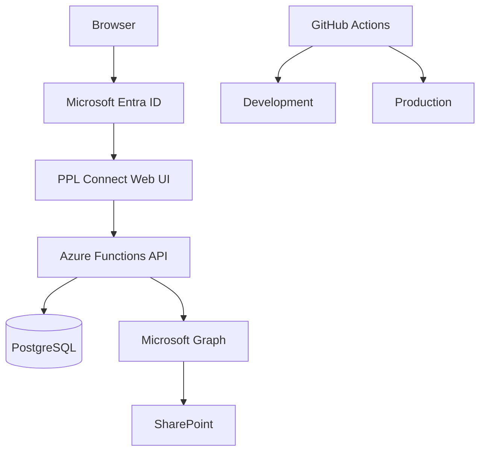

# Architecture

PPL Connect grew from an early browser-based prototype into a multi-layer internal application. The architecture changed as the workflows became more important and needed reliable persistence, stronger authorization, document controls, and a clearer path to production.

## High-level flow

## Browser layer

The browser is responsible for navigation, forms, workflow views, loading states, validation feedback, and presenting the data returned by the API.

I do not treat the browser as a trusted security boundary. A hidden menu item or disabled button improves the experience, but it does not prove that a user is authorized. Sensitive actions are validated again on the server.

## Identity and authentication

Microsoft Entra ID handles sign-in. After authentication, the application still has to map that external identity to a valid PPL Connect user and determine the person's application role and employee relationship.

That distinction became important as the platform evolved. Microsoft identity answers "who signed in?" while PPL Connect answers "what is this person allowed to do here?"

## API layer

The backend is built with TypeScript and Azure Functions. The API became the main boundary for:

- authentication checks
- application-user resolution
- authorization
- workflow rules
- validation
- database writes
- audit-oriented events
- Microsoft Graph and SharePoint operations
- production maintenance controls

This let me move important business logic away from browser-local state and into code that could be tested and enforced consistently.

## PostgreSQL persistence

PostgreSQL stores application and workflow state. As PPL Connect expanded, versioned migrations added the structures needed for employee lifecycle, onboarding, Day-30 follow-up, offboarding, messages, requests, document metadata, document execution, audit events, and administrative workflows.

I used the database as part of the application design rather than as a passive storage layer. Workflow transitions, identity relationships, status changes, and auditability all depend on the data model being explicit.

## Microsoft Graph and SharePoint

Document operations go through backend-controlled integration code. The browser requests an allowed action, the API validates the user and context, and the backend performs the corresponding Graph or SharePoint operation.

This keeps privileged storage details and access decisions away from the browser and gives the application one place to enforce document rules.

## Environment separation

Development and Production are treated as separate environments with separate configuration and release concerns. I wanted production changes to be deliberate, especially for identity, database migrations, document integration, and privileged maintenance.

## Deployment path

GitHub Actions provides repeatable build and deployment workflows. Application deployment and production database migration are intentionally separate concerns so a routine code release does not silently apply schema changes.

## Why the architecture changed

The first version did not need every layer shown above. The architecture became more structured because the business requirements became more serious.

Persistent employee workflows needed a database. Shared access needed real identity. Privileged operations needed server-side authorization. Documents needed a controlled integration boundary. Production use needed testing, environment separation, and release controls.

That evolution is one of the most useful parts of the project for me because each technical layer was added in response to a concrete operational need.