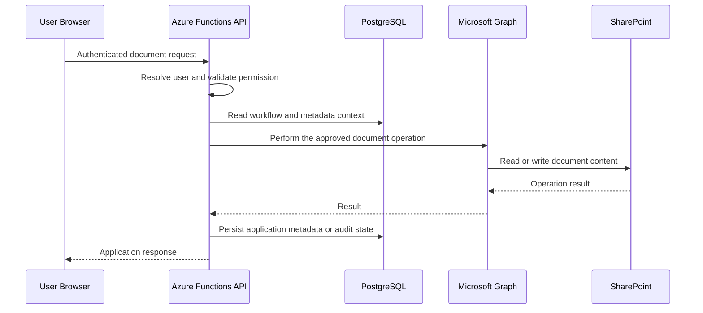

# Document Management

PPL Connect uses Microsoft Graph and SharePoint for document operations while keeping application permissions and workflow rules in the backend.

The goal was to let employees and administrators work with documents through PPL Connect without exposing internal storage configuration to the browser.

## Request flow

## Integration boundary

I keep Microsoft Graph and SharePoint behavior behind a backend integration layer rather than scattering document calls throughout the application.

That layer supports the document actions the application needs, such as browsing approved locations, reading files, uploading files, managing folders, and supporting workflow-specific document behavior.

A simplified interface is included in [`examples/sharepoint-gateway.ts`](../examples/sharepoint-gateway.ts).

## Server-controlled storage rules

For protected workflows, the backend determines the approved storage context based on application rules.

The browser requests a business action, while the server decides how that action maps to the internal document structure. This keeps storage policy and application permissions in one controlled layer.

## Document requests

PPL Connect can represent a request for a document as an application workflow rather than treating every document interaction as a standalone upload.

That allows the system to track status and responsibility around the request while the actual file remains in SharePoint.

## Restricted employee documents

Employee documents have different access needs from general shared documents. I treat those areas as separate concerns instead of assuming every signed-in user should have the same document visibility.

## Document completion and review

As the platform evolved, document workflows expanded beyond basic storage to support concepts such as:

- source document versioning
- revisions
- completion state
- signature or attestation metadata
- integrity metadata
- supporting attachments
- HR review and correction
- finalization

The public repository describes the architecture only. It does not include proprietary employee forms or production workflow data.

## Application metadata

SharePoint stores the document content, while PostgreSQL can store application-specific workflow information such as associations, review status, revision information, and audit events.

This keeps document storage in Microsoft 365 while still allowing PPL Connect to understand the business process around each document.

## Why SharePoint remained the document store

I did not try to turn PostgreSQL into a binary document store.

SharePoint already provides enterprise document storage and Microsoft 365 integration. PostgreSQL is better used for application state around the document, while Graph provides the integration layer between the two systems.

That split kept each system focused on what it does well.