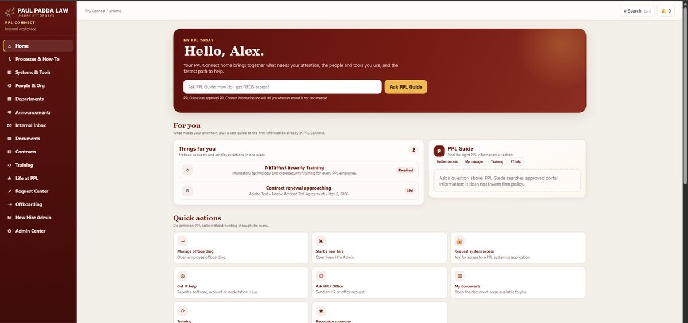
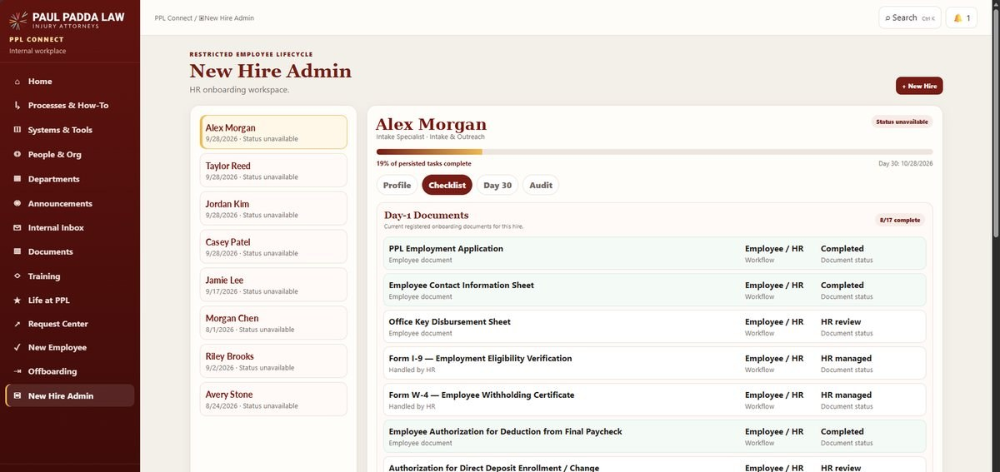
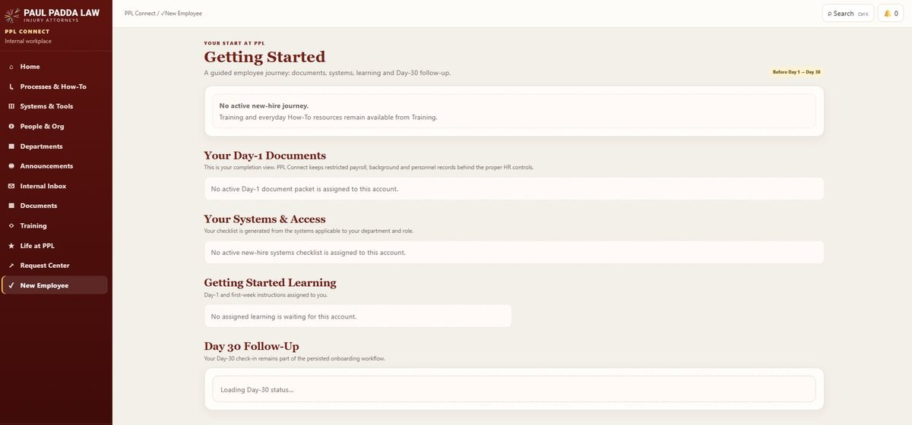
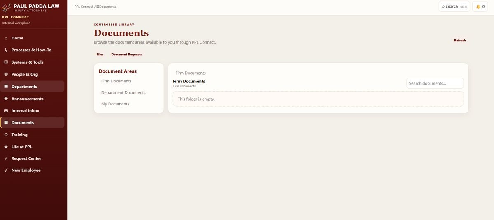
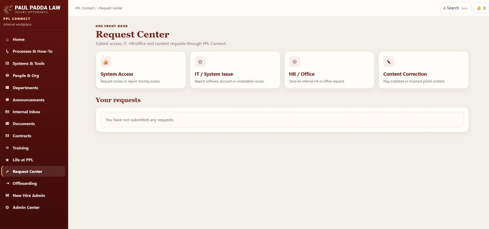
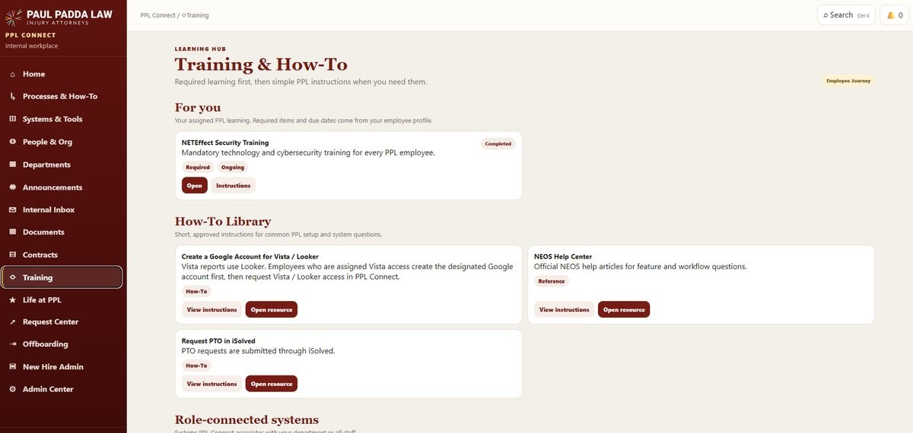
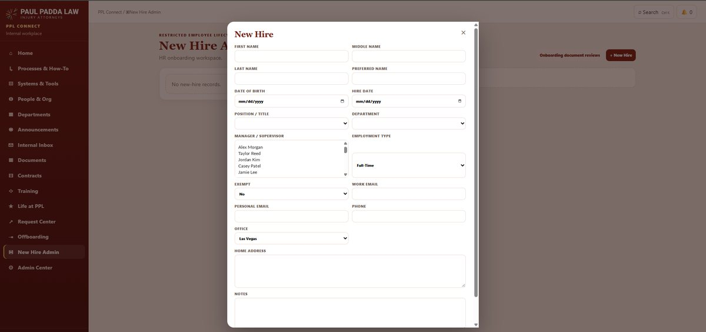
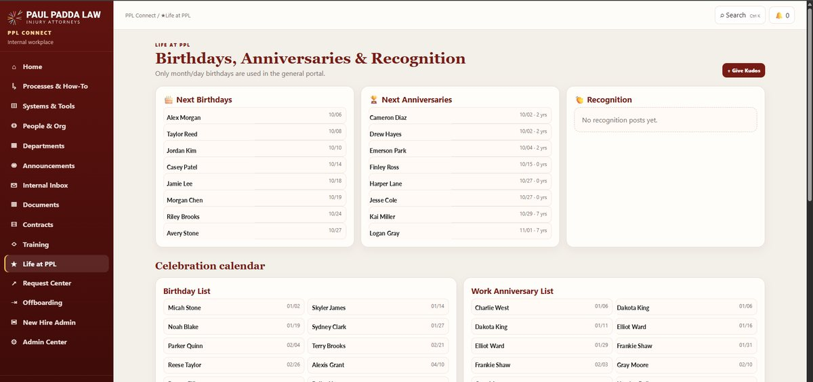
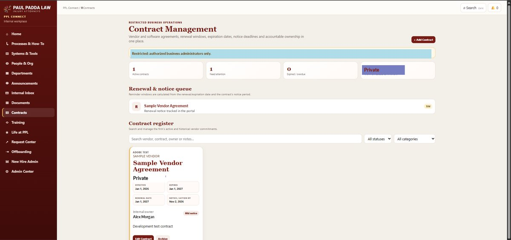
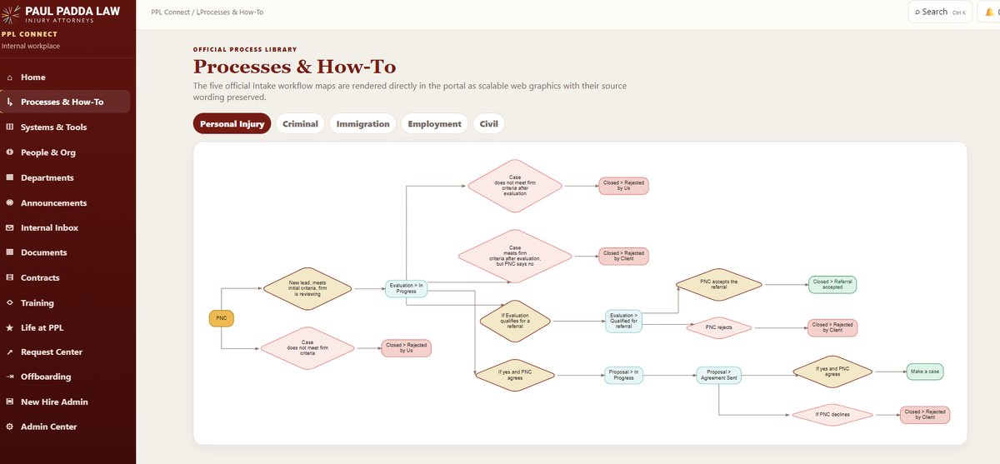

# Product Walkthrough

These screenshots show the product experience I built around PPL Connect. The images are sanitized for public use. Personal names, financial values, internal identifiers, and other sensitive details have been replaced or removed. The layouts and workflows reflect the application itself.

## 1. Home workspace

The home screen brings together tasks, quick actions, internal guidance, and the shortcuts an employee uses most often. I wanted the portal to feel like a practical starting point rather than a collection of disconnected pages.

## 2. New Hire Admin

The administrative side of onboarding tracks a hire as a persisted workflow rather than a one-time form submission. The interface brings together profile state, checklist progress, Day-30 follow-up, document status, and audit-oriented workflow information.

## 3. New Employee journey

The employee-facing side turns onboarding into a guided journey across Day-1 documents, systems and access, learning, and Day-30 follow-up. The same lifecycle has different views and permissions depending on who is using the system.

## 4. Documents

The document experience exposes approved document areas through the application while keeping storage behavior behind the backend integration with Microsoft Graph and SharePoint. The interface supports general, departmental, personal, and request-oriented document workflows without giving the browser unrestricted storage authority.

## 5. Request Center

The Request Center gives employees one place to route common operational needs such as system access, IT issues, HR or office requests, and content corrections. The goal is to make ownership and status clearer than ad hoc email or chat requests.

## 6. Training and How-To

Training combines assigned learning with practical how-to content and role-connected systems. I designed it to support both required training and everyday self-service questions inside the same portal.

## 7. Structured New Hire intake

The New Hire flow captures the structured information needed to start the employee lifecycle. The form is only one part of the workflow. The data becomes the basis for downstream onboarding, access, documents, ownership, and follow-up.

## 8. Life at PPL

The portal also includes employee-experience features such as birthdays, anniversaries, and recognition. This was part of making PPL Connect useful as an internal workplace product rather than only an administrative system.

## 9. Contract Management

The contract workspace organizes restricted business agreements around ownership, renewal windows, expiration dates, notice periods, and attention queues. Public screenshots use synthetic names and redacted financial values.

## 10. Process Library

The process library turns internal workflows into navigable, visual guidance inside the portal. It gives employees a clearer view of how work moves through the organization instead of requiring them to find separate process documents.

## What the screens show together

PPL Connect is not one dashboard or one workflow. It combines employee lifecycle, internal requests, documents, training, process guidance, employee experience, administrative tools, and business operations in one application with shared identity, authorization, persistence, and deployment concerns.

That breadth is what made the project challenging. Each new feature had to fit into the same underlying system rather than becoming another isolated tool.